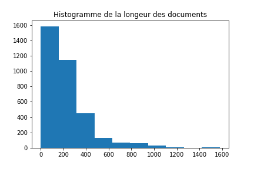

# Final TP - Classification des documents du procès des groupes américains du tabac
L’objectif de ce tp est d’utiliser les méthodes apprises en course d’analyse de texte pour implémenter un classifieur qui peut aider à classer différents types de documents. Les données sont documents du procès des groupes américains du tabac.
Le contenu de ce rapport
  - Analyse des données
  - Analyse du problème
  - Méthodes utilisées et choix justifié de solution
  - Analyse des performances de la solution
  - Pistes d'améliorations

## Analyse des données
Nous avons plus de trois mille (3482) documents avec plusieurs catégories différentes comme étiquettes. Chaque type de texte a des formats spéciaux qui peuvent probablement être considérés comme leurs caractéristiques. Trouvez les images de documents avec le lien : http://data.teklia.com/Images/Tobacco3482.tar.gz
Voici les catégories et le nombre de textes correspondants.

| Catégories | Nombre de documents |
| ------ | ------ |
| Advertisement | 230 |
| Email | 599 |
| Form | 431 |
| Letter | 567 |
| Memo | 620 |
| News | 188 |
| Note | 201 |
| Report | 265 |
| Resume | 120 |
| Scientific | 261 |
Pour bien choisir la valeur de MAX_TEXT_LENGTH, l'histogramme est utilisée. 

## Analyse du problème

Ce que on a sont des documents écrits dans des fichiers(.txt), avec certains formats spéciaux et différents types de sujets, et leur catégorie correcte. Ce que on doit faire est de construire un classificateur, puis de donner certains documents, qui devraient ensuite renvoyer les étiquettes des documents.
Comme les étiquettes sont déjà connues, nous pouvons utiliser certaines méthodes d’apprentissage supervisé pour traiter les textes.

## Méthodes utilisées et choix justifié de solution
Afin d’obtenir un classificateur bien exécuté, j’ai essayé de mettre en œuvre plusieurs modèles différents:
> 1. Naive Bayes classifier
> 2. CNN avec répresentation TF-IDF
> 3. CNN avec une matrice d'embedding basée sur TF-IDF
> 4. CNN avec word2Vec

### 1. Naive Bayes Classifier
Pour avoir une idée, j'ai essayé le classifieur Naive Bayes en ultilisant le CountVectorizer très rapidement.
Le résultat d'accuracy est 0.6944. 

### 2. CNN avec représentation TF-IDF
Par fois, les mots peuvent être traités comme les caractéristiques des documents. Ensuite, chaque texte peut être représenté par la valeur TF-IDF des mots contenus. Donc, Afin d’obtenir les informations des documents, j’ai utilisé TF-IDF pour représenter les documents. 
De plus, le réseau de neurones est performant pour simuler les fonctions non-linéaires. Donc, après avoir représenté les documents, j'ai utilisé un réseau de neurones pour entraîner le classifieur.
Le modèle contient :
>Une couche convolutionnelle d'une dimension pour compresser la taille de vecteur de chaque document.
>Deux couches de Dense, la première couche permet de réduire la dimension, et la deuxième couche est la couche de sortir.

### 3. CNN avec une matrice d'embedding basée sur TF-IDF
Le modèle CNN avec représentation TF-IDF présente uniquement les informations des mots et ne contient pas les informations séquentielles du document. Ainsi, certaines parties de l’information (comme le sens des phrases) sont perdues.
Afin de sauvegarder les informations dans les phrases, nous pouvons utiliser un autre moyen de représentation via le TF-IDF. Avec la matrice de TF-IDF, chaque mot peut être représenté par sa valeur de TF-IDF dans tous les documents. Alors, chaque mot peut être représenté sous forme de vecteur. Ainsi, nous pouvons obtenir les informations des documents en construisant une matrice avec les vecteurs de mots dans le même ordre.
Le modèle de réseau de neurones a la même architecture :
>Une couche convolutionnelle d'une dimension pour compresser la taille de vecteur de chaque document.
>Deux couches de Dense, la première couche permet de réduire la dimension, et la deuxième couche est la couche de sortir.

### 4. CNN avec word2Vec
Afin d’obtenir plus d’informations sur les phrases, j’ai utilisé word2Vec.

## Analyse des performances de la solution
| Modèle | Performance |
| ------ | ------ |
| CNN avec répresentation TF-IDF | 0.7747 |
| CNN avec une matrice d'embedding basée sur TF-IDF | 0.6184 |
|CNN avec word2Vec | 0.7188 |

Le premier modèle est le plus performant. 

Evidement, pour le deuxième modèle, il existe une forte sur-apprentissage. Une raison possible est que la quantité de données est trop petite. En plus, par rapport aux données, le modèle est un peu compliqué.

Théoriquement, le modèle avec word2Vec devrait être le plus performant. Mais le résultat obtenu n'est pas idéal parce que le modèle est très compiqué pour une petite quantité de données.

En conclusion, acev des données qu'on possède, le modèle CNN avec répresentation TF-IDF est le meilleur modèle.

## Pistes d'améliorations
 - La qualité des données n'est pas assez bonne, alors peut-être traiter directement les images.
 - La quantité de données n'est pas suffisante, donc l'ajout de plus de données peut aider à améliorer les performances de tous les modèles.
 - La modification de la structure du réseau de neurones peut également améliorer le résultat. En effet, j'ai essayé d'ajouter une couche LSTM, mais le processus prend trop de temps. Comme je n’ai pas de GPU, travailler avec un CPU est donc unréalisable.

